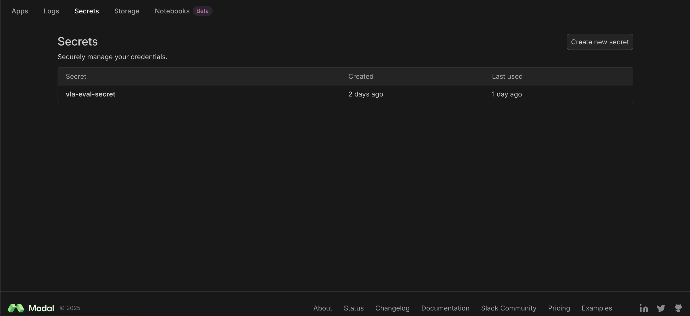
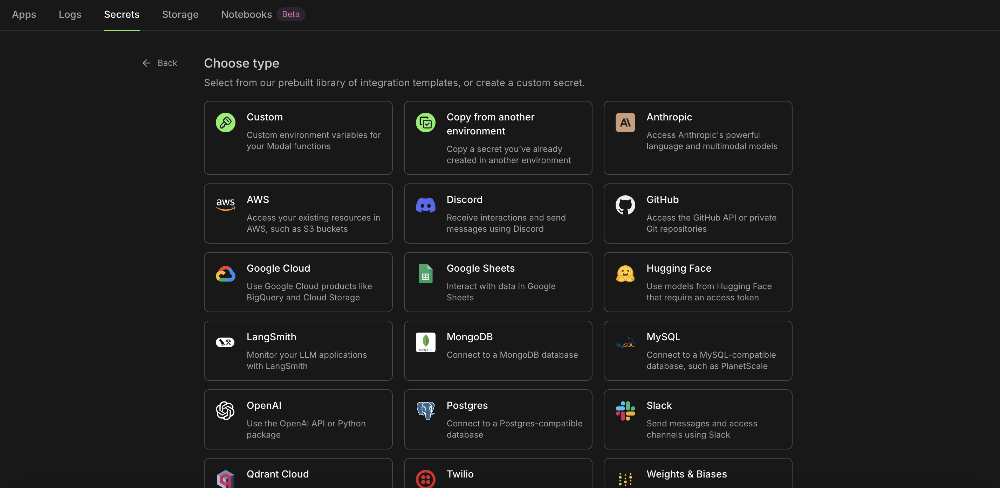
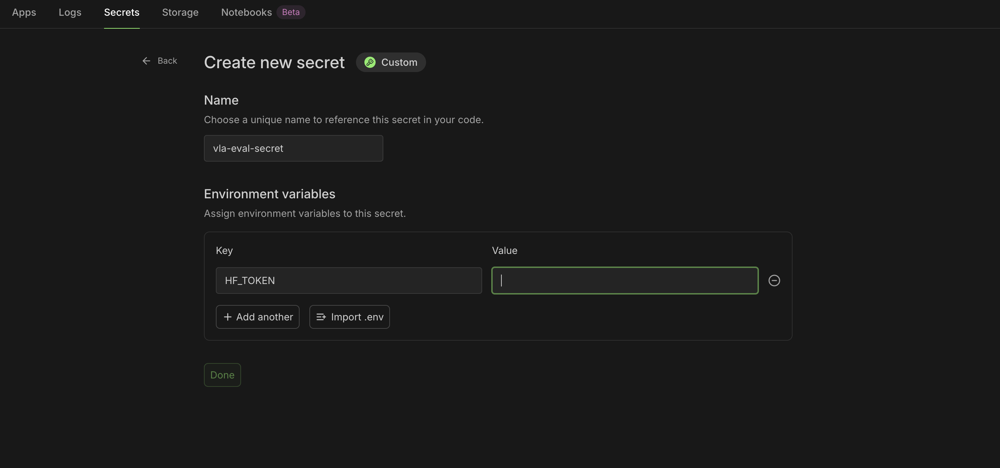

# **VLA Preliminary Model Evaluation**

Given the lack of previous open-sourced work to evaluate vision-language-action (VLA) models on a common set of data with identical
set-up, this project aims to evaluate three open-sourced state-of-the-art (SOTA) VLA models - NORA, Pi-0, GR00T N1.5 - shortlisted from a comparison of 15 VLA models conducted by literature review with a primary focus on **low computational overhead** and **open-source availability**.

The repo contains reproducible code to evaluate NORA, Pi-0, and GR00T N1.5 (currently NORA only) on simulation data, specifically the LIBERO benchmark which has four task suites (Spatial, Object, Goal, Long).

Considering the low success rate of the pre-trained models without fine-tuning, we run only 10 episodes for each task to reduce computation. We run 50 episodes per task for finetuned pre-trained models.

## Getting Started

We use [Modal](https://modal.com/) to run our functions remotely on a GPU-supported cloud. To get started, you need to set-up a Modal account. Please follow the instructions [here](https://modal.com/signup).

Once the account is set-up, clone the repo:
```bash
git clone https://github.com/davidjjeong/vla_test.git
cd vla_test
```

Create a new conda environment and install Modal. No need to install other dependencies as they will be installed when building the Modal image.
```bash
# Create and activate conda environment
conda create -n modal_env python=3.10 -y
conda activate modal_env
pip install modal
python -m modal setup
```

## 1. Download LIBERO Data

Before we start evaluating the VLA models, we need to download the LIBERO dataset into the cloud environment.

Since we use Hugging Face to download the data, you need to set up an user access token on Hugging Face. You can refer to the instructions [here](https://huggingface.co/docs/hub/en/security-tokens). The access token can be read-only. Copy the value of the access token and save it in a safe place where you can remember.

Now, we need to create a secret in your Modal workspace to register your access token. Navigate to **Secrets** tab in your workspace and click the button **Create new secret** as shown below.

<div align="center">

</div>

Then, select **Custom** type for your secret.

<div align="center">

</div>

Follow the configurations as shown in the image below, and paste your copied access token in the **Value** entry.

<div align="center">

</div>

Now you can simply run this command below to download the data.
```bash
modal run experiments/libero/libero_utils.py::download_data
```

## 2. Evaluate VLA Model

Once you have downloaded LIBERO data, you are all set to evaluate your desired VLA model.

Currently, the default setup is

- **GPU**: A100 40GB
- **Eval Data**: LIBERO Spatial (10 episodes per task for 10 tasks; a total of 100 rollouts)
- **VLA Model**: Pre-trained NORA model without fine-tuning

Simply run this command in your terminal to evaluate your VLA model on LIBERO:
```bash
modal run model_summary.py::main
```